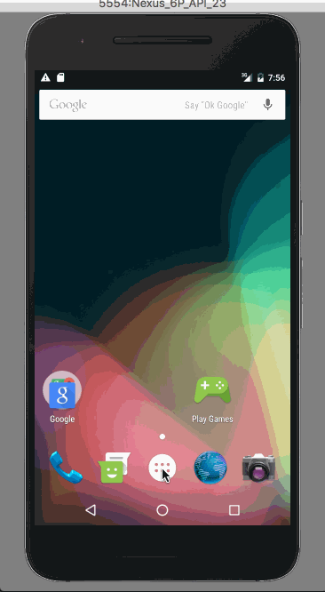

# Simple Todo-App

## User Stories

The following **required** functionality is completed:

* [x] User should be able to **add and remove successfully items**
* [x] User can **edit an item by tapping which brings up an edit screen for the item** and changes are reflected in the todo list.
* [x] User can **persist todo items** and retrieve them when app starts

